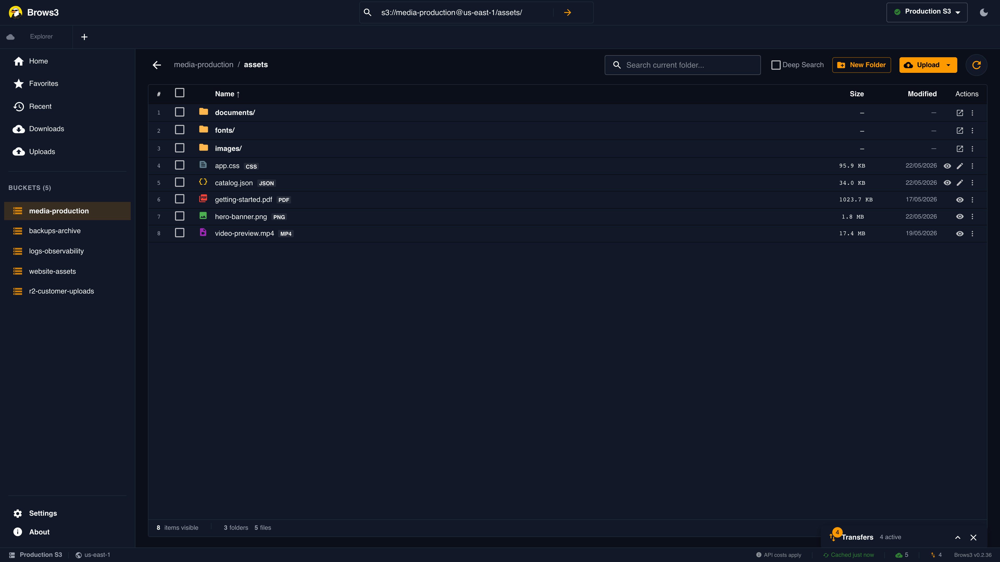
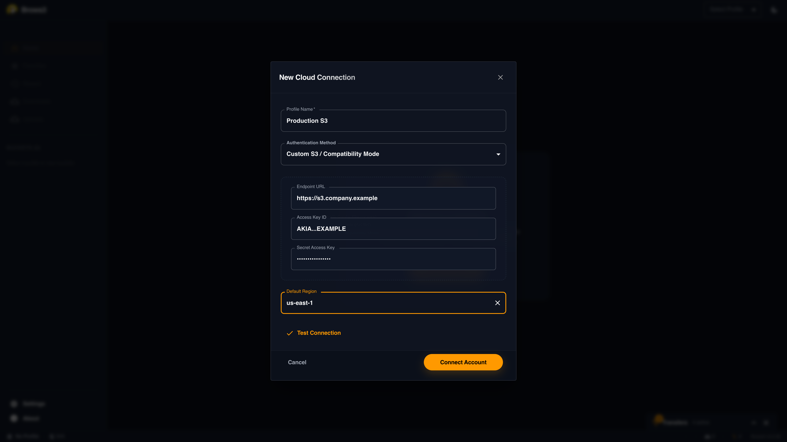
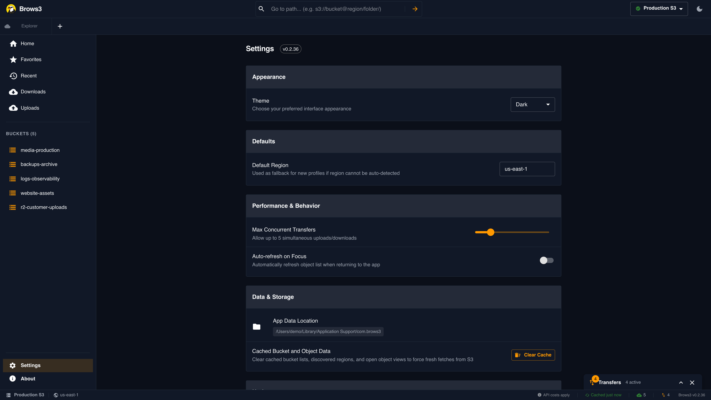

# Brows3

[](https://github.com/rgcsekaraa/brows3/releases)
[](https://opensource.org/licenses/MIT)
[](https://github.com/rgcsekaraa/brows3/actions/workflows/release.yml)
[](https://www.brows3.app/)

**Brows3** is a high-performance, open-source Amazon S3 browser, S3 explorer, and S3 desktop client designed for developers who demand speed. Built with a **Rust** core and a **Tauri**-powered frontend, Brows3 improves slow S3 navigation with prefix-aware folder views, local caching, and a virtualized object table.

Navigating recently loaded buckets and prefixes feels close to browsing a local file system, while direct S3 path access keeps restricted buckets usable even without broad list permissions.

**Website:** <a href="https://www.brows3.app/" target="_blank">brows3.app</a>

Brows3 is built for people searching for a fast **S3 browser**, **AWS S3 client**, **S3 bucket explorer**, **S3 file manager**, or **S3-compatible storage browser** for providers like **MinIO**, **Cloudflare R2**, **Wasabi**, and **DigitalOcean Spaces**.

## Screenshots

<p align="center">
  
</p>

| Add S3-compatible storage | Settings and updates |
| :---: | :---: |
|  |  |

## Who It Is For

Brows3 is a strong fit if you need:

- a desktop S3 browser for large buckets
- a faster S3 explorer than generic cloud-storage tools
- an open-source S3 client for AWS S3 or S3-compatible storage
- a GUI for MinIO, Cloudflare R2, Wasabi, or DigitalOcean Spaces
- a developer-focused S3 file manager with editing, search, and transfer visibility


## Why Brows3?

Traditional S3 tools often suffer from latency when navigating deep folder structures or listing large numbers of objects. If you are comparing tools like an S3 browser, S3 explorer, S3 GUI client, or desktop client for S3-compatible storage, Brows3 focuses the browsing experience around:

- **Fast Cached Navigation**: Recently loaded folders and bucket views are cached so repeat navigation is quick.
- **Deep Search**: Search recursively within a bucket or prefix, with practical limits to keep large object stores responsive.
- **Prefix-Aware Object Cache**: Brows3 builds folder views from cached object keys, reducing repeated S3 listing calls.
- **Virtualized Object Table**: The object table is tuned for large listings without rendering every row at once.

## Feature Deep Dive

### File Management
- **Breadcrumb Navigation**: Path-based navigation for rapid traversal of complex hierarchies.
- **Bulk Operations**: Upload, download, and delete multiple files or recursive folders at once.
- **S3-Compatible Delete Fallback**: Folder deletion falls back to single-object deletes when a provider rejects multi-object delete requests.
- **Mixed Content Support**: Seamlessly handle folders and files in a single drag-and-drop operation.
- **Copy-to-Clipboard**: Quick copy of S3 Paths, Keys, and Object URLs.
- **Presigned URL Sharing**: Generate temporary object links with configurable expiry directly from the bucket view.

### Rich Previews & Editing
- **Built-in Editor**: Powered by **Monaco (VS Code's Engine)**. Edit text, JSON, and code files directly in S3.
- **Direct Edit Action**: Quick "Edit" button in the file list and context menu for instant code/text modifications.
- **Media Previews**: Preview **images**, **videos**, and **PDFs** using presigned object URLs.
- **Rendering Indicators**: Clear visual feedback for large image rendering states.

### Performance

#### **Speed & Performance**
- **Rust-Powered Backend**: Core logic is written in Rust for near-instant operations.
- **Smart In-Memory Caching**: 
  - Sub-millisecond navigation for recently visited folders.
  - **Auto-Invalidation**: Cache automatically refreshes after you upload, delete, or modify files.
  - **30-Minute TTL**: Stale data (from external sources) is automatically purged.
- **Lazy Loading**: Paginates large object listings to keep browsing responsive.

#### **Enterprise & Restricted Access**
- **Direct Bucket Access**: Instantly navigate to specific buckets (e.g., `s3://my-secure-bucket`) even if you don't have `s3:ListBuckets` permission.
- **Profile-Gated Access**: Create isolated profiles for different AWS accounts or environments.
- **Persistent Secure Profiles**: Manual and S3-compatible profiles survive restarts while secrets stay in the OS keychain instead of plain JSON.
- **Cost Awareness**: UI indicators for cached data help you manage S3 API costs.

- **In-App PDF Preview**: View PDFs directly within the application through an embedded presigned preview.
- **Automatic Region Discovery**: Profiles now automatically detect the correct AWS region from system configurations, enabling zero-config setup.
- **Smart Tab Management**: Intelligent tab deduplication ensures you never have multiple tabs open for the same S3 path—automatically switching to existing tabs when searching.
- **Deep Recursive Search**: Search recursively within specific folders with auto-region retry support and safety limits.
- **System Monitor**: Real-time visibility into application performance. Track API request success/failure rates and view live logs for debugging.
- **Profile-Gated Access**: Create isolated profiles for different AWS accounts or environments. Switch contexts instantly with zero friction.
- **Enhanced Settings**:
  - Manage application data, clear cache, and check for updates manually.
  - One-click theme switching (Dark/Light/System).
  - Configure default regions and concurrency limits.
- **Auto-Updates**: Brows3 checks for updates and surfaces available signed releases from Settings/startup.
- **Signed Release Pipeline**: Release automation validates updater signing and publishes updater metadata for desktop update flows.

## Technical Architecture

Brows3 leverages a tiered data strategy to achieve its performance:

1. **Rust Core (The Muscle)**: Handles S3 networking, credential management, and local caching using high-speed concurrency.
2. **Prefix-Indexed Tree**: An in-memory data structure that organizes S3's flat object list into a hierarchical tree, enabling instant directory lookup.
3. **Paginated IPC Bridge**: Data is transferred between Rust and the React frontend over a high-speed, paginated IPC channel, preventing UI hangs during large data transfers.
4. **SSG React (The UI)**: A Next.js-based frontend exported as a static site, providing the smallest possible memory footprint.

## Search Keywords

Brows3 is relevant if you are searching for:

- Amazon S3 browser
- S3 browser desktop app
- S3 client for macOS, Windows, and Linux
- S3 explorer
- S3 bucket browser
- AWS S3 desktop client
- S3-compatible storage browser
- MinIO browser
- Cloudflare R2 desktop client
- Wasabi browser
- DigitalOcean Spaces client
- object storage explorer

## Alternatives And Comparisons

People often discover Brows3 while searching for:

- Cyberduck alternative for S3
- S3 Browser alternative
- open source S3 client
- fast S3 desktop client
- GUI client for Amazon S3
- MinIO desktop client
- R2 browser

Brows3 is focused on fast bucket navigation, deep search, and large-list performance rather than generic cloud-storage support across many unrelated providers.

| If you are searching for... | Brows3 positioning |
| :--- | :--- |
| `Cyberduck alternative for S3` | More focused on S3/object-storage workflows and large bucket navigation |
| `S3 Browser alternative` | Cross-platform open-source desktop option with Rust/Tauri backend |
| `MinIO client` | Works for S3-compatible endpoints through Custom S3 mode |
| `Cloudflare R2 browser` | Relevant when using R2 through S3-compatible credentials |
| `fast S3 desktop client` | Core product focus is speed, caching, and deep recursive search |

## GitHub Setup

To improve discoverability inside GitHub itself, set the repository description and topics in the repo settings.

Suggested repository description:

`Fast open-source S3 browser, S3 explorer, and desktop client for Amazon S3, MinIO, Cloudflare R2, Wasabi, and other S3-compatible storage.`

Suggested topics:

`s3`, `amazon-s3`, `s3-browser`, `s3-client`, `s3-explorer`, `object-storage`, `minio`, `cloudflare-r2`, `wasabi`, `digitalocean-spaces`, `tauri`, `rust`

## Installation

Brows3 is available for all major desktop platforms. Download the latest version from the [Releases](https://github.com/rgcsekaraa/brows3/releases) page.

| Platform | Installer Type |
| :--- | :--- |
| **macOS** | `.dmg` (Apple Silicon/Intel), `.app.tar.gz` updater archives |
| **Windows** | `.msi`, `.exe`, portable `.zip` |
| **Linux** | `.deb`, `.AppImage` for x64 and ARM64 |

Windows releases are configured to bundle the WebView2 runtime with the installer so fresh machines do not depend on a separate runtime download during installation.

### Manual Build

If you prefer building from source, follow the instructions for your platform:

#### Prerequisites (All Platforms)
- **Node.js** v22+ and **pnpm** (install via `npm install -g pnpm`)
- **Rust** (see platform-specific instructions below)

#### Windows Setup

1. **Install Rust**:
   - Download and run the installer from [rustup.rs](https://rustup.rs)
   - Or run in PowerShell: `winget install Rustlang.Rustup`
   
2. **Restart your terminal** to refresh the PATH

3. **Verify installation**:
   ```powershell
   cargo --version
   rustc --version
   ```

4. **Clone and run**:
   ```powershell
   git clone https://github.com/rgcsekaraa/brows3.git
   cd brows3
   pnpm install
   pnpm tauri dev
   ```

#### macOS Setup

1. **Install Rust**:
   ```bash
   curl --proto '=https' --tlsv1.2 -sSf https://sh.rustup.rs | sh
   source ~/.cargo/env
   ```

2. **Install Xcode Command Line Tools** (if not already installed):
   ```bash
   xcode-select --install
   ```

3. **Clone and run**:
   ```bash
   git clone https://github.com/rgcsekaraa/brows3.git
   cd brows3
   pnpm install
   pnpm tauri dev
   ```

#### Linux Setup

1. **Install Rust**:
   ```bash
   curl --proto '=https' --tlsv1.2 -sSf https://sh.rustup.rs | sh
   source ~/.cargo/env
   ```

2. **Install system dependencies** (Debian/Ubuntu):
   ```bash
   sudo apt update
   sudo apt install -y libgtk-3-dev libwebkit2gtk-4.1-dev libappindicator3-dev librsvg2-dev patchelf
   ```

3. **Clone and run**:
   ```bash
   git clone https://github.com/rgcsekaraa/brows3.git
   cd brows3
   pnpm install
   pnpm tauri dev
   ```

#### Release Build (All Platforms)

```bash
pnpm tauri build
```

## Troubleshooting (macOS)

If you see the error **"Brows3.app is damaged and can't be opened"** after downloading:

This usually means the build was downloaded through a browser and Gatekeeper has quarantined it. First, drag `Brows3.app` into `/Applications`, launch it from `/Applications`, and eject the mounted DMG before deleting the installer. If Gatekeeper still blocks the app, run:

```bash
sudo xattr -rd com.apple.quarantine /Applications/Brows3.app
```

Current community builds may still need the quarantine-removal step above. For more details, see our [macOS Troubleshooting Guide](docs/MACOS_TROUBLESHOOTING.md) and [release signing setup guide](docs/RELEASE_SIGNING.md).

## Release Keys

For auto-updates to install correctly, the GitHub Actions secrets must include `TAURI_SIGNING_PRIVATE_KEY` and `TAURI_SIGNING_PRIVATE_KEY_PASSWORD`, and the matching public key must be present in `src-tauri/tauri.conf.json`. The exact GitHub path is:

`Repository Settings -> Secrets and variables -> Actions`

If you already added the secrets for Tauri, double-check that the secret names are exact and that the committed updater `pubkey` still matches the private key currently stored in GitHub.

## Contributors

We welcome contributions from the community! Whether you are a Rustacean, a React developer, or as a technical writer, your help is appreciated.

- **Founder & Maintainer**: [rgcsekaraa](https://www.linkedin.com/in/rgcsekaraa/)
- **Core Engineering**: Brows3 Open Source Team

Want to become a contributor? Check out our [Contributing Guide](https://github.com/rgcsekaraa/brows3/blob/main/CONTRIBUTING.md) and join us in building the world's fastest S3 browser!

## How to Contribute

1. **Check the Issues**: Look for "good first issue" labels.
2. **Standard Workflow**: Fork -> Branch -> Commit -> Pull Request.
3. **Code Quality**: Ensure Rust code is formatted with `cargo fmt` and TS code with `pnpm lint`.

## License

Distributed under the MIT License. See `LICENSE` for more information.

---
Created by [rgcsekaraa](https://www.linkedin.com/in/rgcsekaraa/). Built for the community.
